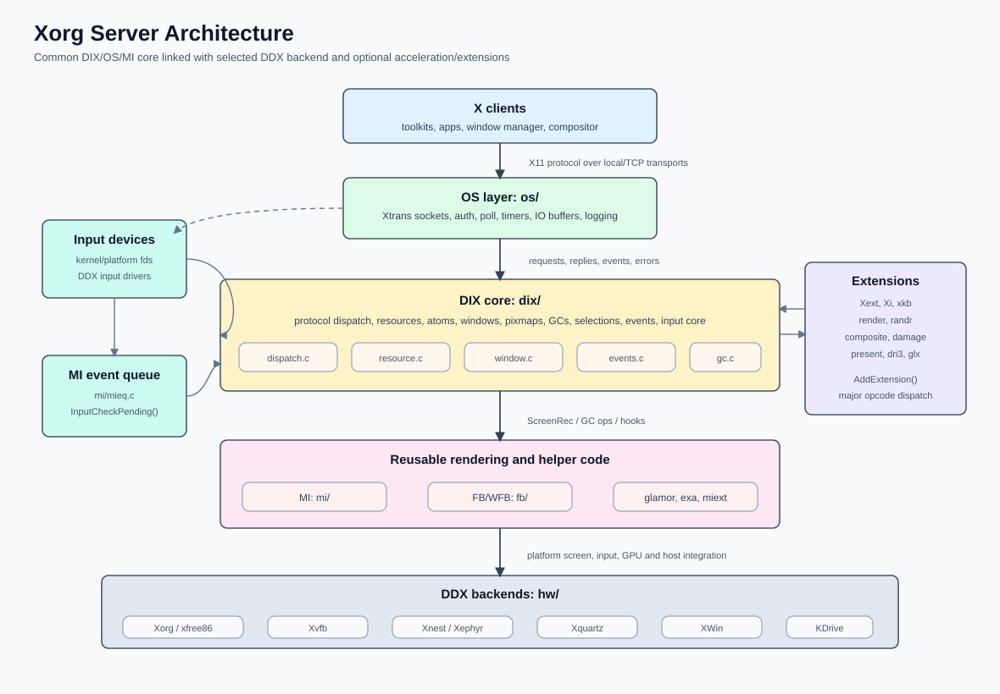
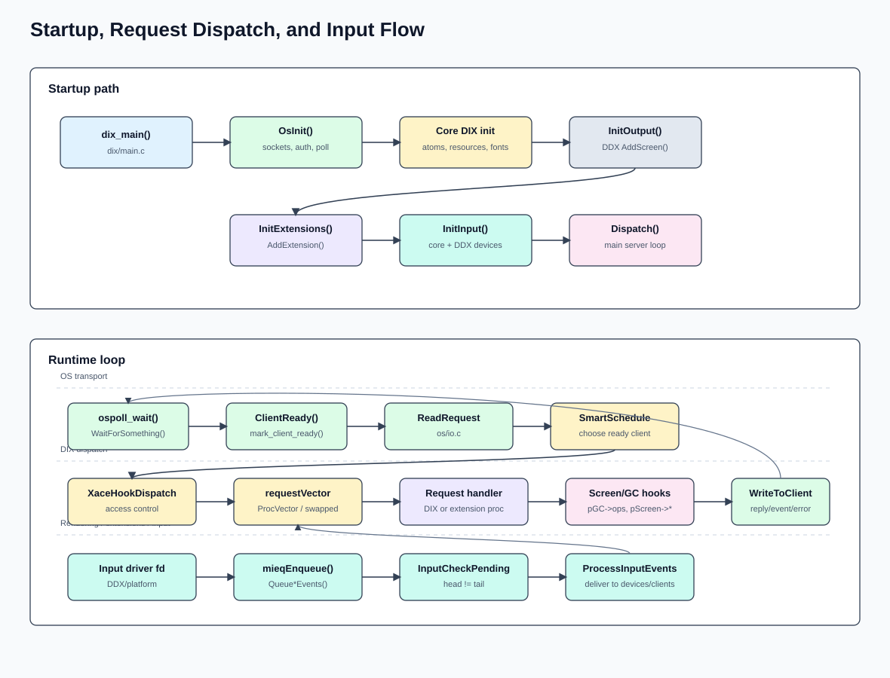
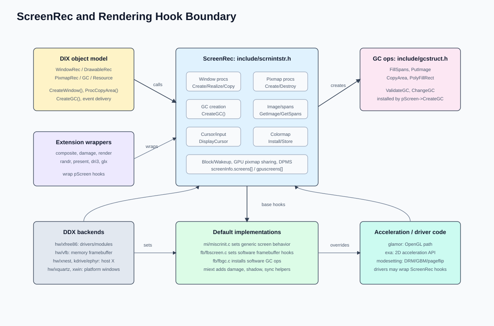

# Xorg Server Architecture

> 文件名按需求使用 `archicture.md`。

## 架构图

## 模块分层

| 层 | 目录 | 主要职责 |
|---|---|---|
| DIX core | `dix/` | X11 协议派发、资源表、窗口树、GC、pixmap、事件、输入核心、server generation 生命周期。入口在 `dix/main.c`，请求循环在 `dix/dispatch.c`。 |
| OS layer | `os/` | Xtrans 连接、认证、poll、timer、输入线程、读写缓冲、日志。核心文件是 `os/connection.c`、`os/WaitFor.c`、`os/io.c`、`os/inputthread.c`。 |
| MI | `mi/` | 与硬件无关的屏幕/窗口/绘制辅助、事件队列、扩展初始化列表。`mi/miscrinit.c` 填默认 `ScreenRec` 行为，`mi/mieq.c` 管输入事件队列，`mi/miinitext.c` 初始化内建扩展。 |
| FB/WFB | `fb/` | 软件 framebuffer 实现，提供 `ScreenRec` 和 `GC` 的基础绘制实现；`fb/fbscreen.c`、`fb/fbgc.c` 是关键边界。 |
| Extensions | `Xext/`, `Xi/`, `xkb/`, `render/`, `randr/`, `composite/`, `damageext/`, `present/`, `dri3/`, `glx/` | 通过 `AddExtension()` 注册 major opcode、事件和错误空间；部分扩展会 wrap `ScreenRec` hooks。 |
| DDX backends | `hw/` | 平台/设备相关服务器：`hw/xfree86` 生成 `Xorg`，`hw/vfb` 生成 `Xvfb`，`hw/xnest`/`hw/kdrive/ephyr` 代理宿主 X，`hw/xquartz`/`hw/xwin` 接平台窗口系统。 |
| Acceleration/helpers | `glamor/`, `exa/`, `miext/` | GL/EXA 加速和 damage/shadow/sync 等辅助实现，被 DDX 或扩展接入。 |
| Interfaces | `include/` | 内部 ABI/结构体边界，如 `ScreenRec`、`GC`、`ClientRec`、`ExtensionEntry`。 |

根 `meson.build` 先构建公共静态库：`mi -> dix -> dri3/glx/fb/os -> extensions`，汇总为 `libxserver`，再由 `hw/*` 选择性链接成具体服务器。

## 启动生命周期

`dix_main()` 是公共入口：

1. 初始化区域、命令行、授权和 OS 层：`OsInit()`、`CreateWellKnownSockets()`。
2. 创建 server client、资源系统、atoms、events、fonts、callbacks。
3. 调用 DDX 的 `InitOutput(&screenInfo, argc, argv)`；DDX 通过 `AddScreen()`/`AddGPUScreen()` 填充 `ScreenRec`。
4. `InitExtensions()` 遍历 `ExtensionModuleList`，每个扩展调用自己的 init 并执行 `AddExtension()`。
5. 为每个 screen 创建 scratch pixmap、screen resources、root window、默认 GC/font/cursor。
6. `InitCoreDevices()`、DDX `InitInput()`、`InitAndStartDevices()` 建立输入设备。
7. `CreateConnectionBlock()` 生成客户端握手信息，`InputThreadInit()` 后进入 `Dispatch()`。

`Xorg` DDX 的 `InitOutput()` 在 `hw/xfree86/common/xf86Init.c`：读取配置，初始化 loader，bus probe，加载显卡/输入模块，调用驱动 `PreInit()`，最后 `AddScreen(xf86ScreenInit, ...)`。

## 请求派发

运行时主循环在 `dix/dispatch.c:Dispatch()`：

1. `WaitForSomething()` 调 `ospoll_wait()` 等客户端 fd、输入 fd、timer 和 block/wakeup handler。
2. `ClientReady()` 将可读客户端放入 ready list。
3. `SmartScheduleClient()` 选择客户端。
4. `ReadRequestFromClient()` 从 `os/io.c` 读完整 `xReq`。
5. 根据 `reqType` 进入 `client->requestVector[majorOp]`；普通请求走 `ProcVector`，扩展请求走扩展注册的 dispatch proc。
6. handler 查资源、执行业务逻辑，绘制请求通过 `GC->ops` 和 `ScreenRec` hooks 落到 MI/FB/加速/DDX。
7. `WriteToClient()` 缓冲 reply/event/error，`FlushAllOutput()` 再写回客户端。

安全扩展在请求执行前走 `XaceHookDispatch()`，资源访问处还会调用 `XaceHook()`。

## 输入路径

输入由 DDX/platform 驱动读取设备 fd：

1. Xorg 输入驱动调用 `xf86Post*Event()`。
2. DIX 事件构造函数 `QueuePointerEvents()`、`QueueKeyboardEvents()` 等生成 `InternalEvent`。
3. `mieqEnqueue()` 放入 MI event queue，并通过 `SetInputCheck(&head, &tail)` 暴露给主循环。
4. `Dispatch()` 发现 `InputCheckPending()` 后调用 `ProcessInputEvents()`。
5. DDX 的 `ProcessInputEvents()` 通常转入 `mieqProcessInputEvents()`，再调用设备 `processInputProc`，最终生成发给客户端的 X events。

启用输入线程时，`os/inputthread.c` 用单独 poll 线程读输入 fd；无法启用时回退到 `SetNotifyFd()` 由主 poll 处理。

## 渲染边界

`ScreenRec` 是 DIX 与 DDX/渲染实现的核心边界。它包含窗口、pixmap、cursor、colormap、GC 创建、block/wakeup、GPU pixmap sharing 等函数指针。

典型绘制请求：

1. `ProcCopyArea()`、`ProcPutImage()` 等在 `dix/dispatch.c` 校验 drawable/GC。
2. 调用 `pGC->ops->CopyArea()`、`pGC->ops->PutImage()` 等。
3. `pGC->ops` 由 `pScreen->CreateGC()` 安装；默认软件路径由 `fb` 提供。
4. glamor/exa/driver 可以替换或 wrap `ScreenRec` hooks 和 GC ops。

窗口生命周期同样通过 `ScreenRec`：`CreateWindow()`、`RealizeWindow()`、`ValidateTree()`、`WindowExposures()` 等 DIX 调用会进入当前 screen 的实现。

## 扩展模型

扩展初始化入口集中在 `mi/miinitext.c`：

- 静态扩展表包含 GE、SHAPE、XInput、XKB、XFixes、Render、RANDR、Composite、Damage、Present、DRI3、GLX 等。
- Xorg DDX 在 `xf86ExtensionInit()` 中额外加入 VidMode、DGA、DRI/DRI2 等 DDX-specific 扩展。
- 每个扩展通过 `AddExtension(name, events, errors, proc, sproc, close, minorOpcode)` 分配 major opcode。
- 扩展请求进入对应 `Proc*Dispatch()`，再按 minor opcode 分发。

## 关键结构

| 结构 | 文件 | 作用 |
|---|---|---|
| `ClientRec` | `include/dixstruct.h` | 客户端状态、请求向量、序号、major/minor opcode、OS private。 |
| `ScreenInfo` / `ScreenRec` | `include/scrnintstr.h` | 全局屏幕数组和每个 screen 的 DDX/MI hook 表。 |
| `WindowRec` | `include/windowstr.h` | 窗口树节点、clip/border region、事件 mask、Composite redirect 状态。 |
| `GC` / `GCOps` | `include/gcstruct.h` | 绘制状态和绘制函数表。 |
| `ExtensionEntry` | `include/extnsionst.h` | 扩展 name、major opcode、event/error base、minor opcode 解析。 |
| `DeviceIntRec` | `include/inputstr.h` | server 内部输入设备，挂接 master/slave、processInputProc。 |

## 具体服务器形态

| 目标 | 目录 | 特点 |
|---|---|---|
| `Xorg` | `hw/xfree86` | 硬件/DRM/PCI/udev/logind/loader 路径，支持外部显卡和输入驱动模块。 |
| `Xvfb` | `hw/vfb` | 纯内存 framebuffer，主要链接 `fb + libxserver`。 |
| `Xnest` | `hw/xnest` | 把 screen/window/GC 映射到宿主 X server。 |
| `Xephyr` | `hw/kdrive/ephyr` | KDrive 后端，使用 XCB 连接宿主 X，可接 glamor。 |
| `Xquartz` | `hw/xquartz` | macOS Quartz/AppKit 集成，含 rootless/pseudoramiX。 |
| `XWin` / `Xming` | `hw/xwin` | Windows/Cygwin 集成，含 clipboard、multiwindow、OpenGL/Windows DRI 支持。 |

## 代码阅读入口

- 公共入口：`dix/main.c`
- 主循环与请求派发：`dix/dispatch.c`
- 请求表：`dix/tables.c`
- 连接与 IO：`os/connection.c`、`os/io.c`、`os/WaitFor.c`
- 输入队列：`mi/mieq.c`
- screen hook 定义：`include/scrnintstr.h`
- GC ops 定义：`include/gcstruct.h`
- 默认 screen/fb 实现：`mi/miscrinit.c`、`fb/fbscreen.c`
- Xorg DDX 初始化：`hw/xfree86/common/xf86Init.c`
