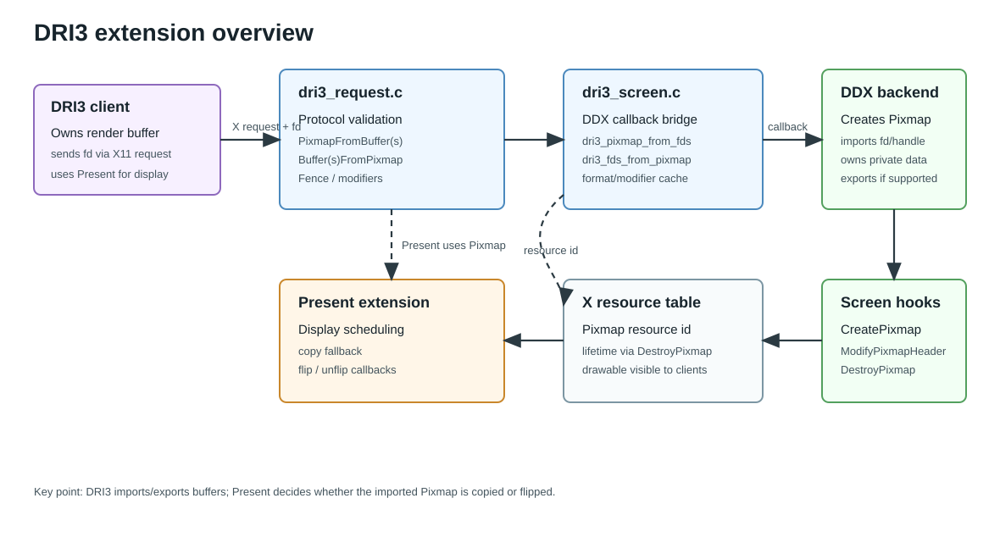
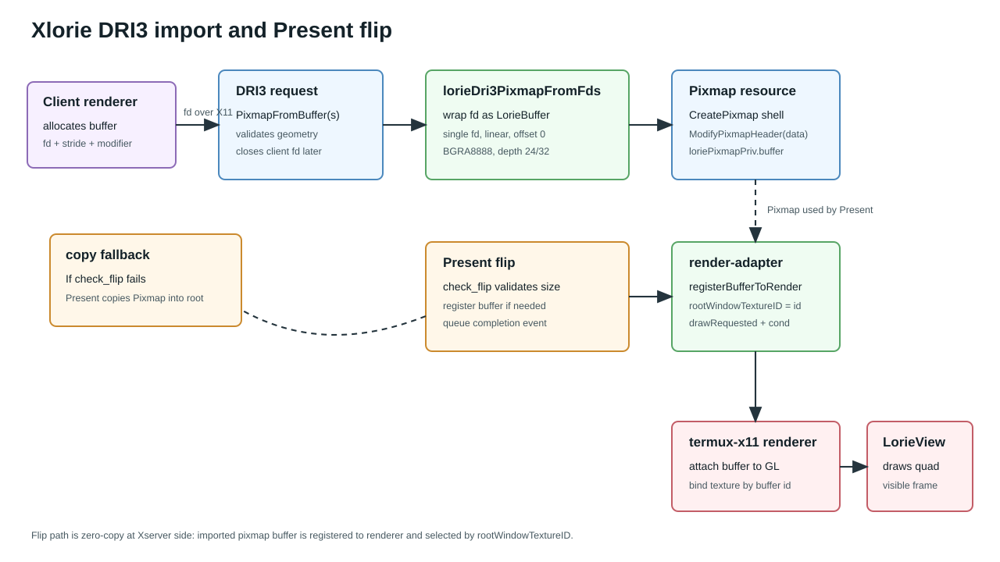
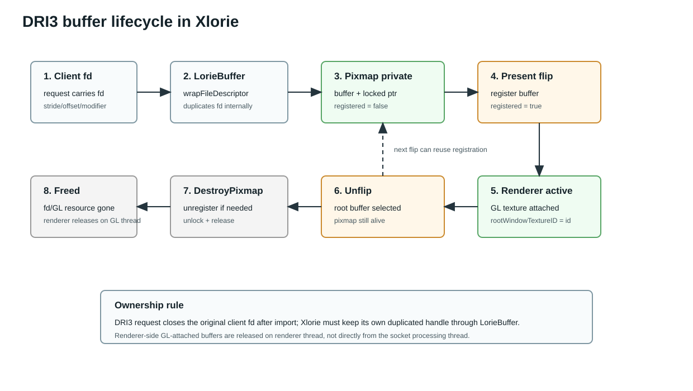

# DRI3 技术架构

本文描述 xorg-server 的 DRI3 扩展架构，以及当前 `hw/lorie` 后端中 DRI3 与 Present/termux-render 的集成方式。

## 架构图







## 模块边界

| 模块 | 文件 | 职责 |
|---|---|---|
| DRI3 扩展入口 | `dri3/dri3.c` | 为每个 `ScreenPtr` 初始化 DRI3 private；注册扩展请求分发表。 |
| 请求分发 | `dri3/dri3_request.c` | 处理 `PixmapFromBuffer(s)`、`Buffer(s)FromPixmap`、fence、modifier 查询等协议请求。 |
| DDX 适配层 | `dri3/dri3_screen.c` | 把协议层请求转成 `dri3_screen_info_rec` 回调。 |
| DDX 回调表 | `dri3/dri3.h` | 定义 `pixmap_from_fds`、`fds_from_pixmap`、`get_modifiers` 等后端 ABI。 |
| Present | `present/` | 负责 vblank、copy、flip、unflip；DRI3 只负责 buffer/pixmap 导入导出。 |
| Xlorie DDX | `hw/lorie/InitOutput.c` | 实现 DRI3 import、modifier 查询、Present flip 到 `rootWindowTextureID`。 |
| render bridge | `hw/lorie/render-adapter.c` | 封装 termux-render 连接、buffer 注册/注销、root buffer 切换。 |
| renderer 端 | `termux-render` / `termux-x11` | 通过控制 socket 注册 `LorieBuffer`，renderer 把 buffer attach 成 GL texture。 |

## DRI3 核心模型

DRI3 的核心抽象是“客户端拥有 buffer，X server 只接收 buffer 句柄并把它变成 Pixmap 资源”。

1. 客户端通过 X11 request 发送 dma-buf/shared-memory fd。
2. DRI3 协议层读取 fd，并调用 `dri3_pixmap_from_fds()`。
3. `dri3_screen.c` 按 DDX 能力选择 `pixmap_from_fds` 或旧版 `pixmap_from_fd`。
4. DDX 创建 `PixmapPtr`，把 fd 封装到自己的 pixmap private 中。
5. 请求层给 pixmap 设置 resource id，并加入 X resource table。
6. 后续绘制/Present 只操作 Pixmap，具体 buffer 语义由 DDX private 维护。

DRI3 不做显示调度，也不决定 flip/copy。显示路径由 Present 扩展决定：

- copy：Present 把 pixmap 内容复制到 screen pixmap。
- flip：Present 调用 DDX `.flip`，让显示目标直接切到 pixmap 对应 buffer。

## 协议路径

### PixmapFromBuffer

`proc_dri3_pixmap_from_buffer()` 处理旧版单 fd 请求：

1. 校验 drawable、depth、width、height。
2. `ReadFdFromClient()` 取出客户端传入 fd。
3. 使用 `DRM_FORMAT_MOD_INVALID` 调用 `dri3_pixmap_from_fds()`。
4. 请求结束后关闭原始 fd。

因此后端必须在 `pixmap_from_fds` 内部复制或接管 fd。当前 Xlorie 走 `LorieBuffer_wrapFileDescriptor()`，其内部会 `dup(fd)`。

### PixmapFromBuffers

`proc_dri3_pixmap_from_buffers()` 处理 DRI3 v1.2 多 plane + modifier 请求：

1. 读取 `num_buffers` 个 fd。
2. 传入 strides、offsets、modifier。
3. 调用 `dri3_pixmap_from_fds()`。
4. 请求层统一关闭客户端 fd。

当前 Xlorie 只接受单 fd、linear/invalid modifier、offset 0。

### BuffersFromPixmap

`proc_dri3_buffers_from_pixmap()` 依赖 DDX 的 `fds_from_pixmap`。

当前 Xlorie 不导出 server pixmap fd：

- `lorieDri3FdFromPixmap()` 返回 `-1`。
- `lorieDri3FdsFromPixmap()` 返回 `0`。
- 对应协议请求返回 `BadPixmap`。

## Xlorie DRI3 后端

当前 Xlorie 后端注册：

```c
static dri3_screen_info_rec lorieDri3Info = {
    .version = 2,
    .pixmap_from_fds = lorieDri3PixmapFromFds,
    .fd_from_pixmap = lorieDri3FdFromPixmap,
    .fds_from_pixmap = lorieDri3FdsFromPixmap,
    .get_formats = lorieDri3GetFormats,
    .get_modifiers = lorieDri3GetModifiers,
    .get_drawable_modifiers = lorieDri3GetDrawableModifiers,
};
```

`lorieDri3PixmapFromFds()` 的约束：

| 条件 | 当前行为 |
|---|---|
| fd 数量 | 只接受 `numFds == 1` |
| modifier | 只接受 `DRM_FORMAT_MOD_INVALID` 或 `DRM_FORMAT_MOD_LINEAR` |
| offset | 只接受 `offsets[0] == 0` |
| bpp | 只接受 `32` |
| depth | 只接受 `24` 或 `32` |
| format | 封装为 `AHARDWAREBUFFER_FORMAT_B8G8R8A8_UNORM` |

导入流程：

1. `LorieBuffer_wrapFileDescriptor(width, stride / 4, height, BGRA8888, fd, 0)`。
2. `LorieBuffer_lock()` 得到 CPU 地址。
3. `screen->CreatePixmap(screen, 0, 0, depth, 0)` 创建 pixmap shell。
4. `screen->ModifyPixmapHeader(..., stride, data)` 绑定 pixmap storage。
5. 在 pixmap private 中保存 `LorieBuffer *buffer`、locked pointer、registered 状态。

销毁流程：

1. 如果 pixmap buffer 已注册到 renderer，先 `lorieRenderUnregisterBuffer()`。
2. 如果 buffer 仍 locked，调用 `LorieBuffer_unlock()`。
3. `LorieBuffer_release()` 释放 buffer 引用。
4. 继续调用原始 `DestroyPixmap`。

## Present flip 集成

Xlorie 的 Present 回调负责把 DRI3 pixmap 变成 renderer 可显示的 texture。

### check_flip

`loriePresentCheckFlip()` 要求：

- DRI3 开启。
- pixmap 带 `loriePixmapPriv.buffer`。
- pixmap 尺寸等于 screen 尺寸。

不满足时 Present 走 copy fallback。

### flip

`loriePresentFlip()` 执行：

1. 若 pixmap buffer 尚未注册，调用 `lorieRenderRegisterBuffer()`。
2. 调用 `lorieRenderUseBuffer(priv->buffer)`，把 `serverState->rootWindowTextureID` 切到 pixmap buffer id。
3. 标记 `drawRequested` 并唤醒 renderer。
4. 把 Present completion event 放入 Xlorie vblank 队列，由 block handler 后续调用 `present_event_notify()`。

completion 不能在 `.flip` 内同步触发，因为 Present core 在 `.flip` 返回后仍会继续设置 flip window/root pixmap 状态。

### unflip

`loriePresentUnflip()` 调用：

1. `lorieRenderUseBuffer(lorieRenderBuffer())` 切回 root framebuffer。
2. `present_event_notify(eventId, 0, 0)` 通知 Present unflip 完成。

## termux-render 控制通道

新增公开 API：

```c
int registerBufferToRender(LorieBuffer *buffer);
int unregisterBufferFromRender(LorieBuffer *buffer);
```

协议复用已有事件：

| 事件 | 方向 | payload | 作用 |
|---|---|---|---|
| `EVENT_ADD_BUFFER` | Xserver -> renderer | `LorieBuffer` + fd/AHardwareBuffer handle | 注册额外可显示 buffer |
| `EVENT_REMOVE_BUFFER` | Xserver -> renderer | buffer id | 注销 buffer |

renderer 端处理：

1. `waylandRenderServer.c` 收到 `EVENT_ADD_BUFFER`。
2. `LorieBuffer_recvHandleFromUnixSocket()` 反序列化 buffer。
3. `rendererAddBuffer()` 放入 `addedBuffers`。
4. renderer thread 执行 `LorieBuffer_attachToGL()`，加入 active `buffers`。
5. redraw 时按 `rootWindowTextureID` 查找 buffer 并 bind texture。

注销时：

1. `rendererRemoveBuffer(id)` 从 `addedBuffers`、`buffers` 或 `removedBuffers` 中转移/释放。
2. 已 attach 到 GL 的 buffer 在 renderer thread 中释放，避免跨线程销毁 GL texture。

## 数据结构

### `dri3_screen_info_rec`

DDX 必须通过它声明 DRI3 能力。Xlorie 当前只实现 import 与 modifier 查询，export 明确禁用。

### `loriePixmapPriv`

当前 Xlorie 的 DRI3 pixmap private：

```c
typedef struct {
    LorieBuffer *buffer;
    void *locked;
    Bool registered;
} loriePixmapPriv;
```

含义：

- `buffer`：对应客户端传入 fd 的 shareable buffer。
- `locked`：pixmap CPU 访问地址。
- `registered`：是否已经通过 termux-render 控制通道注册到 renderer。

### `lorie_shared_server_state`

关键字段：

- `rootWindowTextureID`：renderer 当前应显示的 buffer id。
- `drawRequested`：唤醒 renderer 并要求 redraw。
- `cond`：跨进程条件变量。
- `lock`：root buffer 绘制同步锁。

## 能力与限制

当前实现目标是验证 DRI3 import + Present flip 到 LorieView，能力边界如下：

| 能力 | 状态 |
|---|---|
| DRI3 fd import | 支持单 fd linear BGRA/XRGB/ARGB 类路径 |
| DRI3 modifier 查询 | 支持 `XRGB8888`、`ARGB8888` + linear |
| DRI3 pixmap export | 暂不支持 |
| Present copy fallback | 支持，由 Present core 走常规 copy |
| Present flip | 支持注册 pixmap buffer 并切 `rootWindowTextureID` |
| AHardwareBuffer DRI3 import | 暂未接入，当前路径使用 fd-backed `LorieBuffer` |
| 多 plane / non-linear modifier | 暂不支持 |
| 非 0 offset | 暂不支持 |

## 调试入口

| 问题 | 重点检查 |
|---|---|
| DRI3 请求失败 | `dri3/dri3_request.c` 的请求校验；Xlorie `lorieDri3PixmapFromFds()` 条件是否命中。 |
| pixmap 能创建但不能 flip | `loriePresentCheckFlip()` 尺寸和 pixmap private；Present 是否改走 copy fallback。 |
| flip 后黑屏 | renderer 是否收到 `EVENT_ADD_BUFFER`；`rootWindowTextureID` 是否为已 attach buffer id。 |
| buffer 泄漏 | pixmap destroy 是否调用 unregister；renderer `removedBuffers` 是否在 GL thread release。 |
| 花屏/撕裂 | fd stride、format、CPU lock/unlock、renderer `LorieBuffer_bindTexture()`。 |

## 后续扩展点

1. 支持 AHardwareBuffer socket modifier：在 DRI3 import 中接入 AHardwareBuffer handle，再封装为 `LorieBuffer`。
2. 支持非 0 offset：让 `LorieBuffer` 保存 map base 与 visible data offset，避免当前 offset 0 限制。
3. 支持 pixmap export：为 server-side pixmap 分配 shareable fd/AHardwareBuffer，并实现 `fds_from_pixmap`。
4. Present completion 更精确化：使用 renderer frame callback 或 eventfd 反馈替代当前 vblank 队列近似通知。
5. 多 buffer/多 plane：扩展 `LorieBuffer` 描述或引入 plane array。
